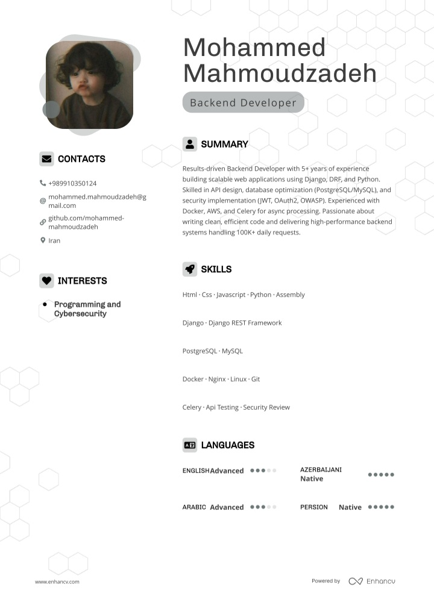

## 👋 Hi, I’m Mohammed Mahmoudzadeh

I am a dedicated software developer with deep expertise in Python, Django, Docker, PostgreSQL, Bootstrap, and TailwindCSS. My work focuses on building robust, scalable, and maintainable web applications, with a strong commitment to modern software engineering principles.

**Cybersecurity is at the core of my development philosophy**—I continuously integrate best security practices and stay updated with the latest advancements to ensure the safety and resilience of every project I work on.

- 🔐 Passionate about secure coding and proactive in identifying potential vulnerabilities.
- 💡 Skilled in advanced Python techniques and efficient backend architecture design.
- 🚀 Experienced in containerizing applications with Docker for streamlined deployment and scalability.
- 💾 Proficient in designing and optimizing databases with PostgreSQL.
- 🎨 Adept at crafting responsive and modern user interfaces using Bootstrap and TailwindCSS.
- 🤖 Actively expanding my knowledge in artificial intelligence and its integration into real-world applications.
- 📈 Lifelong learner dedicated to continuous technical growth and excellence.

Let’s connect—I’m always open to new challenges and collaborations, especially those that value security and innovation!

[Download My Resume](MohammedMahmoudzadehResume.pdf)
